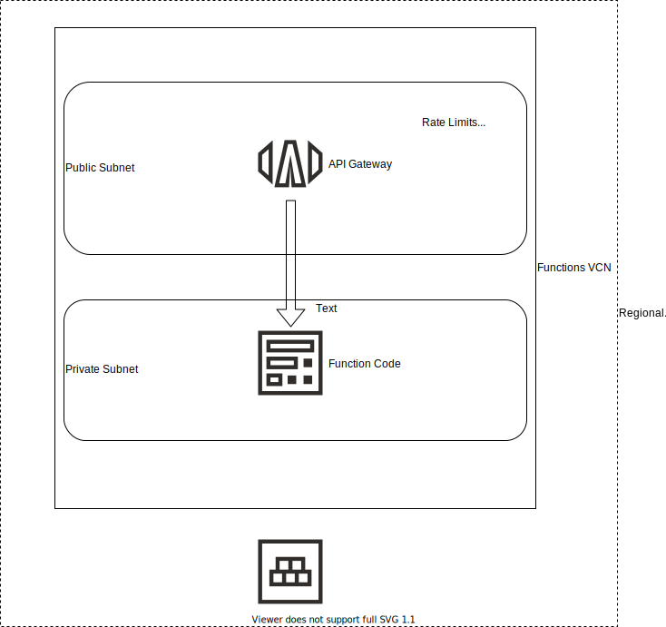

# Digital Signature Verification

This use case is based on a customer requirement to ensure that messages received as part of a processing flow are verified to have been untouched since they were created.  The original example uses XML Digital Signature in Java, and is implemented as an Oracle Service Bus callout.  As part of a move to Oracle Integration Cloud (OIC), the same type of flow is needed, but without a Java callout.   

This repository contains functions written to accomplish the task of taking an XML file, along with the OCID of a pre-shared secret key, doign the validation, and returning `true` or `false`.  

Each function can stand on its own, but likely is to be incorporated into a processing flow.  Included are call examples and the overall flow if applicable.  

- [Python - Message Signing](sign-message-python) 
- [Python - Signature Verification](verify-signature-python) 
- [Event Flow - Python](verify-signature-python-event) 
- [XML Digital Signature - Java](verify-signature-java) 
 
## API Gateway

Once the functions are deployed and working from the command line, it may be desired to add in an API Gateway to allow external invocation, with control over rates, authentication, and other access characteristics.  It is also likely that callers may be authenticated outside, such as with an OAuth token.

In the simplest case, the API Gateway is added to the public subnet that corresponds to the Functions subnet



## CURL Example

To call the completed API Gateway, use CURL as follows:

```bash
prompt> echo "abc"|base64
YWJjCg==

prompt> curl -X POST https://xxx.apigateway.us-ashburn-1.oci.customer-oci.com/vaultsign/sign -H "Content-Type: application/json" -d '{"base64message":"YWJjCg=="}'


{
  "key_id": "ocid1.key.oc1.xxx",
  "key_version_id": "ocid1.keyversion.oc1.xxx",
  "signature": "evcQLTI0hAqQGYrfTP5laVaUutjw9Sw5MMdFwxOVIBh+3CJj/fJSkkef8b3zakP0Y/hXx9ulj7LwAYeDPFYN1GHqMET5FWScM1V9F5Q2GqPRQiTPuQJZOt1bodnIR92XAJafeL9MPi3uVHjVnp7QCRrR8KsPNMtQLeyFRswDlZkLTOQVEqeKLPVmmZklz5bscgUv6ly/qrJsOGikdqXKY5iScb6JttA/cy6S4M/Xgfh34Rghhio5AbRE5plf8Bug8HJkmbe8Ydg2mCCteZ4iQze0PIhX1lO+pHv1+VTsj28AaNdeV/Yowq0G5NKQLoVhdSCzEUMbhLfZmsQCGl7qhw==",
  "signing_algorithm": "SHA_224_RSA_PKCS_PSS"
}

prompt> curl -X POST https://xxx.apigateway.us-ashburn-1.oci.customer-oci.com/vaultsign/verify -H "Content-Type: application/json" -d '{"base64message":"YWJjCg==","signature":"evcQLTI0hAqQGYrfTP5laVaUutjw9Sw5MMdFwxOVIBh+3CJj/fJSkkef8b3zakP0Y/hXx9ulj7LwAYeDPFYN1GHqMET5FWScM1V9F5Q2GqPRQiTPuQJZOt1bodnIR92XAJafeL9MPi3uVHjVnp7QCRrR8KsPNMtQLeyFRswDlZkLTOQVEqeKLPVmmZklz5bscgUv6ly/qrJsOGikdqXKY5iScb6JttA/cy6S4M/Xgfh34Rghhio5AbRE5plf8Bug8HJkmbe8Ydg2mCCteZ4iQze0PIhX1lO+pHv1+VTsj28AaNdeV/Yowq0G5NKQLoVhdSCzEUMbhLfZmsQCGl7qhw=="}'
{
  "is_signature_valid": true
}
```
Another example, using a different API in the same gateway:
```bash
prompt> INPUT=$(<input-base64-good.txt)
prompt> curl -X POST https://xxx.apigateway.us-ashburn-1.oci.customer-oci.com/xmldigitalsignature/verify -H "Content-Type: application/json" -d '{"base64InputXML":"'${INPUT}'","secretOcid":"ocid1.vaultsecret.oc1.xxx"}'
{"verified":true,"detail":"|Digital signature VALID!!!"}%
```

